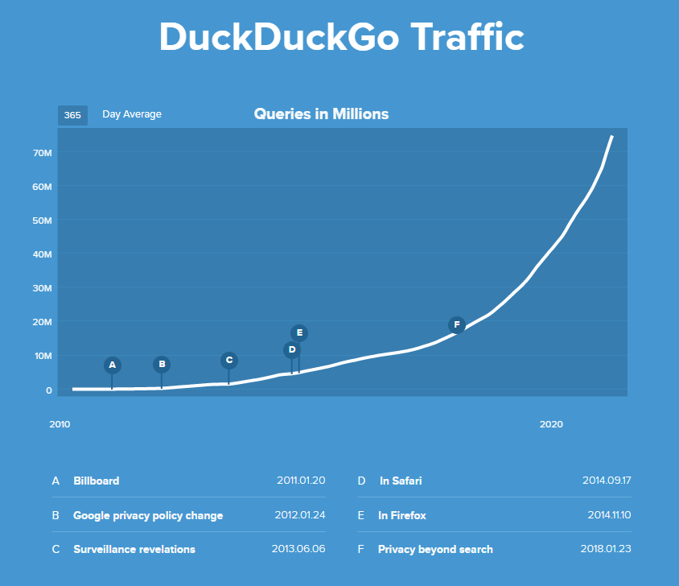

Engineering as marketing is a practice of using engineering resources to create tools complementary to the core product, targetting potential users. Mostly, the tools serve a single-purpose and are free to use.

The tools can be:

- calculators
- widgets
- checkers
- micro-sites
- mini-courses
- checklists, etc.

## Getting started with Engineering as Marketing

First, figure out the real problems that the potential users face in your industry. Research, analyze data, interview users, talk to experts, and do whatever you can to find the real problem(s).

And, then create a simple (and, free) tool that eases the problem out. Develop a tool that people will thank you for.

> If you provide answers to peoples' burning questions, you will get noticed.

Please remember that a single tool won't fit all.

Divide your potential audience into multiple groups based on some important KPIs and then proceed to create tools for the important ones.

### How the tool should be like

An ideal acquisition tool should:

- revolve around the core product
- be user friendly and free
- solve obvious pain points
- solve the problem in a unique & better way
- target specific audience
- serve a single purpose
- provide added value to the target user
- be relevant to your business
- have a strong Call to Action (CTA)
- narrate the importance of your core product
- contain evergreen contents
- have appealing social proof

## What are the benefits?

Creating such a tool using engineering as marketing has enormous benefits on your business, take a look:

- builds trust and boost credibility
- increases views and leads
- provides extra value to your audience
- helps with PR push
- brings huge SEO benefits
- increases brand awareness
- increases the core value proposition

**People love free stuff!!!**

And, when they see a company uniquely solving their problems, for free - they get flattered.

## Examples of companies doing it right

We don't realize but companies are using this strategy for decades.

In the early days, LinkedIn's launched an Outlook plugin that let users easily upload their email contacts and invite them to LinkedIn; it's a great example of engineering as marketing.

Here're some other awesome examples:

### DuckDuckGo

Don't Track Us by DuckDuckGo is the best example of leveraging engineering as marketing to complement the core product.

[Don't Track Us](https://donttrack.us/) explains how Google tracks everyone. And, in the end, it shows how people can protect their personal information by switching to the DuckDuckGo search engine.

DuckDuckGo also has a blog called [Spread Privacy](https://spreadprivacy.com/) where they write about internet privacy. And, according to SimilarWeb, it generates more than 300,000 monthly traffic.

There's no data on how helpful "Don't Track Us" and "Spread Privacy" have been for the core business, but the traffic on the DuckDuckGo website has risen exponentially over the years.

### AR-based IKEA Place App

IKEA, the furniture and home accessories giant, is another best example of using engineering as marketing at its best.

The company has created an augmented reality (AR) based app that lets users virtually test IKEA's products in their homes.

I mean, you can almost exactly know how a chair will look in your room - colors, size, design, and all.

## Wrapping it up

The concept of engineering as marketing isn't new though, it's been there for decades.

And, the strategically created tools do not only generate heavy leads but are also good for brand awareness and boosting credibility.

> Promote the acquisition tools, not the main product.

That's it.

**Food for thought:** Engineering and marketing - can we call these a match made in heaven?