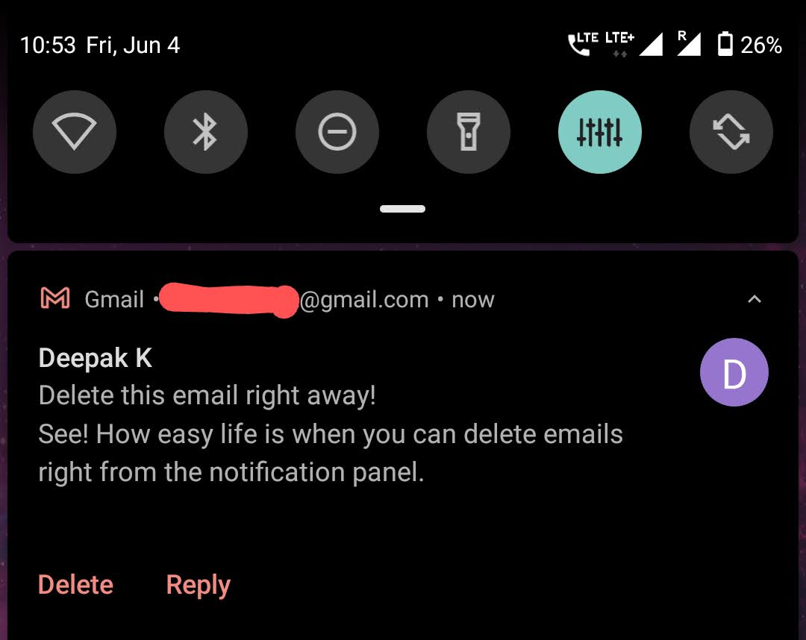

If you're an Android user then you must be using the Gmail app on your smartphone. And, you must be receiving tens of daily emails too.

To be honest, most of the emails are just unnecessary updates from various sites and are not worth keeping for future references.

For example, when you buy something from Amazon, they will send you 3-4 emails back to back. One, confirmation that the order has been placed, second about the payment through the Amazon UPI, and others about various offers.

You can delete them right away.

But... to delete, you need to open the Gmail app and then you can delete the email. Because, by default, the 2 options that show up in the notification are **Archive** and Reply.

This means, either you can directly reply to that email or send it to the archive folder.

If you navigate to the **Settings** > **General settings** of the Gmail app then you'll find an option called Default notification action; change that option to **Delete** from Archive.

And... now, whenever you receive an email, you'll get 2 options as **Delete** and Reply.

You can delete unwanted and unnecessary email directly from your smartphone notification. It does make the deletion process easier that ultimately saves you valuable time.