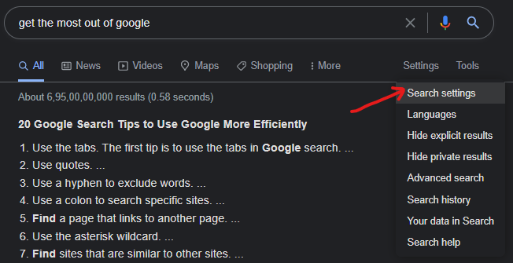
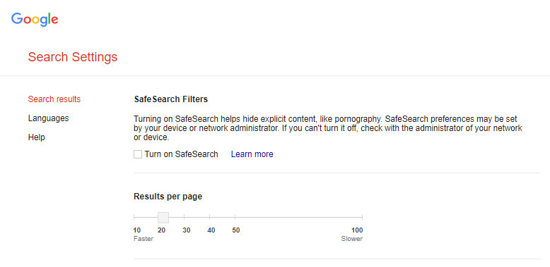

No matter how advanced Google's algorithms are, it doesn't always show the best results on the first page. Sometimes, the results get manipulated by the crazy SEOs out there.

It happens that I am googling for something specific and unable to find it on the first page even after numerous attempts. And, then that thing can be easily found on the second page.

You might have heard SEOs [saying](https://www.theleverageway.com/blog/real-deal-with-bob-kehoe-best-place-to-hide-a-dead-body/), "the best place to hide a dead body is on the 2nd page of Google".

But... sometimes, 2nd page is just lit.

## The Google 2nd page hack

Well, it's certainly my personal experience but it does work.

I have set the default number of search results per page to 20 on Google. And, whenever I google something, I see 20 results on the first page. It means 2nd-page results too are being shown on the first page.

And, you see more results on the topic, and that ultimately broadens your thinking, your perspective and helps you get more ideas.

## How to show 20 results on the first page

It's as simple as ABC.

⚡ By the way, I am assuming you're on your computer. I haven't checked but there must be similar settings for smartphones as well.

-   Search something on Google
-   Go to Search Settings under Settings

-   Increase the Results per page option to 20 from 10
-   Scroll down and save the page

Done!

Now, whatever you search on Google, 20 results will be shown.

**So, why just 20? why not 30 or 100?**

For me, 10 search results seem less and 30 or more seem way more. I've tried doing 50 search results per page, but then I start drowning in the information overload.

20 Google search results per page seem optimum to me.

Hope that helps. ✌