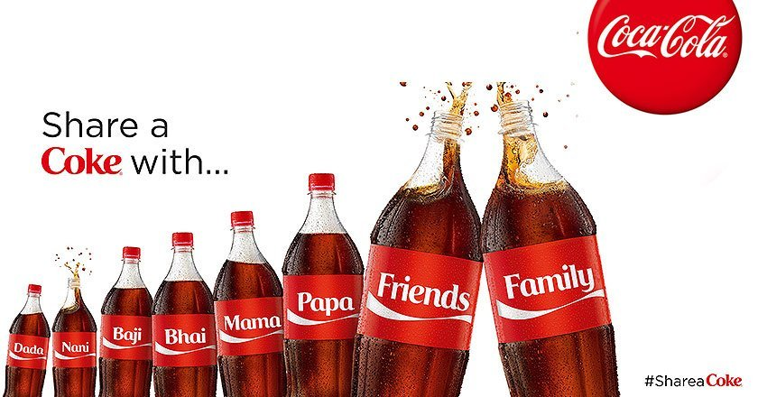

All of a sudden everyone began to grasp what this new generation is and how they act differently than the older generation.

Born in the ‘90s raised around the millennium in the year 2000 I am one of these creatures. So what’s the mystery about these millennials and what do they want different from others?

It took a while before I realized what makes my generation different. All people have the same basic needs, don’t we?

But maybe it is somehow true we have a different mindset – a millennial mind. And all marketers obviously want to understand the hopes, dreams, and desires of the millennial.

> We are a non-traditional social generation.

Social media is indeed space where we spend much time. So you probably signed up on different platforms. But please think about how dedicated you’re really going to be.

You shouldn’t be on any social network if you’re not willing to keep it up to date and you don’t need to be on every platform. Do think about their purposes.

Facebook is maybe a bit more personal than Twitter, so their posts should have a different tone of voice.

Also, younger people are much more active on the newer social media such as Instagram and Snapchat, that’s where their friends are and not their moms and aunts.

Okay, so what is it that millennials really want? How do they behave? And, most importantly how can we as marketers relate to it?

Let’s understand...

## Millennials’ Expectations from the Internet

We (millennials) have a few expectations from the internet, which are:

### \#1. We want to relate to you in an authentic way

We appreciate when something is bigger than us and love it when brands take a creative approach to help us see their mission.

Millennials express themselves through the best brands and want the brands to be much more than just a logo.

They want brands with an appearance that they like and can relate to. Think about Coca-Cola’s 'share a coke' campaign.

Coca-Cola attempted (& succeeded too) to make friends with Millennials by developing the hugely popular campaign ‘Share a Coke’.

Probably the first time Coca-Cola made such major changes to their marketing and packaging too. They probably understood the need to connect with ‘us’ Millennials.

The campaign had a lot to do with the brand attributes and the appearance of the company Coca-Cola. On their website, colleagues explain the huge effort they took to pull this campaign off in 2013.

‘Share a Coke’, the campaign was focused to engage consumers in such a way that reinforced core brand attributes.

### \#2. We spend money on experiences, not things

This does not mean we don’t like to shop, we just like to share our thoughts and feelings about it better than the buying itself. We love word of mouth and naturally want to share experiences with others.

We millennials love experiences, after all, we are the ones who attend the parties, concerts, festivals, shows, and sports games, right?

So the best way to connect us to your brand is to get the talk going. Get people excited about your brand and we will talk about it – online and offline.

Based on recent studies, 78% of millennials are more likely to become part of a brand if they can have face-to-face interaction with it.

And this is the main reason why building physical experiences are so important.

For example a bottle of Coke with your name on it, or even better your friends’ name or someone you love like ‘Dad’ or your favorite celebrity so you can #shareacoke in the offline world and on social media.

### \#3. We don’t like traditional marketing

You’ve probably guessed that one, right? Have you mastered that though?

It can be difficult to move from the standard, “Save $100 when you book your hotel now!” to the Millennial preferred approach of something like: “Check out our blog on the top ten wacky hotels to visit this spring break! We can even help you save $100 by clicking our link at the end!”.

We want interesting and we want creative. If you’re hitting us with a sales pitch that adds no significant experience to our lives, we just plain won’t listen. Don’t you love our stubbornness?

## Wrapping it up

Honestly, though, we can see when you don’t care versus when you do. If we don’t feel you care about us, why should we care about your product or service?

In the end, the best thing you can do is spend less time trying to figure us out and more time listening to us, caring about what we want and what we have to say, and marketing to us by really adding value to our lives.

Don’t think of Millennials as some mysterious new generation to be figured out.

Find us on our turf, help us relate to you, and add something of value (small or large) to our daily lives.

- - -

**💬 Discussion**

Let's [discuss on LinkedIn](https://www.linkedin.com/posts/deepakness_what-a-millennial-wants-from-the-internet-activity-6776048342242775040-JjMZ)