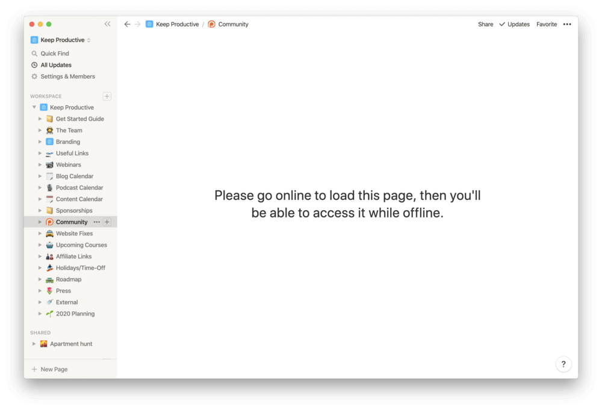

> Get through a draft as quickly as possible. - Joshua Wolf Shenk

Writing is already full of friction and if the tool you're using takes too much time to load, it's not the one.

Notion is an amazing document management tool. But, writers need tools that are fast, distraction-free, and easy to get started with.

When I first got introduced to Notion, I thought this is the tool I've been waiting for. And, I transferred all the notes into it.

But realized soon after that Notion is not an ideal tool for writing.

Let me explain:

## Notion is slow

Yes! Frustratingly slow.

It takes ages to open. And, if one needs to write a quick draft, it's just not a handy tool.

The same applies to the mobile app.

I went back to using Google Keep to note down quick drafts and ideas on my phone.

## I spent a lot of time organizing my stuff

Every time I opened Twitter or Reddit, someone would be showing off their beautiful Notion setup. And, I'd start redesigning/modifying my dashboard.

Yes, it's kind of my own fault. But again, a problem is a problem. 😉

I spent a lot of time organizing my stuff rather than actually creating/writing stuff.

## No offline backup

Notion has no offline feature yet - neither the mobile nor the desktop app.

And, it causes some real problems. If it goes down then you have [no access](https://www.keepproductive.com/blog/the-major-flaws-with-notion) to your data until it's back up again, like it happened recently:

During this major [outage](https://twitter.com/NotionStatus/status/1370577772880437253?s=20), I was unable to access any of my data.

For writing, offline tools like [Obsidian](https://obsidian.md/) and [Typora](https://typora.io/) are the best because they are fast and distraction-free.

However, I still use Notion to organize most of my stuff. But for writing, I've started using Obsidian.

- - -

**💬 Discussion**

Let’s [discuss this on Twitter](https://twitter.com/DeepakNesss/status/1370717768119558145?s=20)