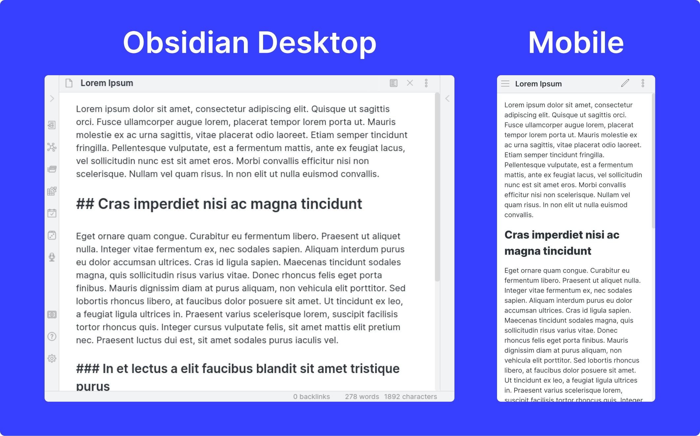

Obsidian Android app is finally live! 🔴

I have been experimenting with the app for the last few days and have discovered some interesting things.

Earlier, I was using Obsidian on my Linux and Windows 10 PC. I used Google Drive to sync the Obsidian Vault between computers.

Now, since the [mobile app](https://obsidian.md/mobile) is live, I decided to sync the vault among my laptop, PC and Android device.

Google Drive worked fine for syncing between the computers but there's no efficient way to sync a local Android folder with the Google Drive remote folder.

Yes, there are a few third-party options like Autosync and FolderSync, but I did not want to involve another client which will have access to all my data.

Later, I came across [Syncthing](https://syncthing.net/) and decided to give it a try. I knew about Syncthing from earlier but never thought to use it in this setting.

After trying, it turned out to be exactly what I was looking for.

Obsidian's mobile app is so cool -- the look and feel are almost exactly the same as the desktop app. You can install multiple themes, plugins and customize them the way you want.

Also, Syncthing is open-source, free and available for Windows, Linux, Android and macOS devices (not for iOS though) so there shouldn't be any problem.

And the best thing about Syncthing, it doesn't require internet bandwidth to work. Your devices just have to be on the same wifi network.

I absolutely love the setup!

---

**💬 Discussion**

Let’s discuss this on [Twitter](https://twitter.com/DeepakNesss/status/1415948555513065472?s=20)